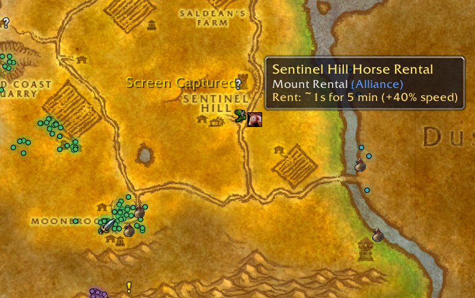

# OctoTravel

A travel atlas for **OctoWoW** (and other Turtle WoW-based 1.12 servers).
Every way to get around Azeroth, on your world map and minimap:

- **Boats** - every dock, with destination, crossing time and departure
  frequency in the tooltip, including Turtle's custom routes (Stormwind
  Harbor, Sparkwater Port, the Icepoint Rock ferry, Alah'Thalas...)
- **Zeppelins** - all towers, every platform's destination
- **Deeprun Tram** - both stations
- **Flight masters** - all 99 of them, vanilla and custom zones alike
  (Gilneas, Tel'Abim, Hyjal, Grim Reaches, Balor, Northwind and more),
  color-tagged by faction
- **Rentable mounts** - Turtle's rental horses, wolves and rams in the
  towns that offer them
- **Portals & teleporters** - city portals, the Hyjal and Moonwhisper
  runestone networks

## Install

No dependencies - it's a plain addon built entirely on the stock 1.12 API.
No DLLs, no game patches, nothing else to install.

**Manual:** download this repository ([zip](../../archive/refs/heads/master.zip))
and put the `OctoTravel` folder into `Interface\AddOns\` so you have
`Interface\AddOns\OctoTravel\OctoTravel.toc`. Restart the game or relog.

**OctoLauncher:** add this repository's git URL as an addon - the folder
name and .toc already match.

## Use

Open the world map. Travel pins appear on any zone that has them; hover
for the details, click a boat/zeppelin/tram pin to jump to its destination
zone's map.

The **Travel** button in the top-right corner of the map toggles everything;
right-click it to filter by category, show the other faction's pins, or
turn minimap pins on and off.

Slash commands (`/octotravel` or `/otr`):

| Command | Effect |
|---|---|
| `/otr` | show/hide all pins |
| `/otr boat` (`zeppelin`, `tram`, `flight`, `rental`, `portal`) | toggle one category |
| `/otr enemy` | show/hide other-faction pins |
| `/otr minimap` | toggle minimap pins |
| `/otr add <type> <name>` | add your own pin where you stand |
| `/otr list`, `/otr remove <n>` | manage your pins |

Your own pins are saved per account; shift-click one on the map to remove it.

## About the data

- Flight master positions are generated from the server's own spawn
  database, so they include every custom flight point.
- Boat, zeppelin and tram boarding points come from the client's own
  transport path data (TaxiPathNode) and 1.12 dock triggers - every
  boat and zeppelin route shown has its path verified in the game files.
- Custom routes, flight paths and unlock conditions match
  [OctoWoW's official transport page](https://octowow.st/additional-transport-routes).
- Route times are approximate community measurements - vanilla transport
  schedules drift with server restarts, so treat them as ballpark figures.

Spotted a pin in the wrong place, or something missing? Stand on the right
spot, run `/otr add <type> <name>`, and open an issue with the coordinates
it prints (or a pull request against `data.lua`). That is exactly what the
command is for.

## Credits

Zone dimension data and the minimap projection technique come from
[pfQuest](https://github.com/shagu/pfQuest) by Shagu (MIT). Location
research draws on [OctoWoW's transport page](https://octowow.st/additional-transport-routes),
the [Turtle WoW wiki](https://turtle-wow.fandom.com)
and [warcraft.wiki.gg](https://warcraft.wiki.gg).

MIT licensed - see [LICENSE](LICENSE).
